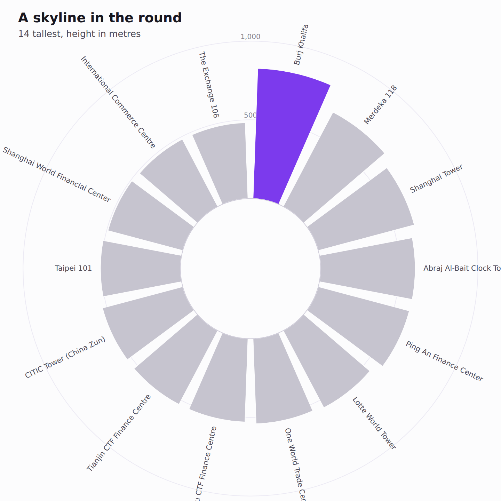
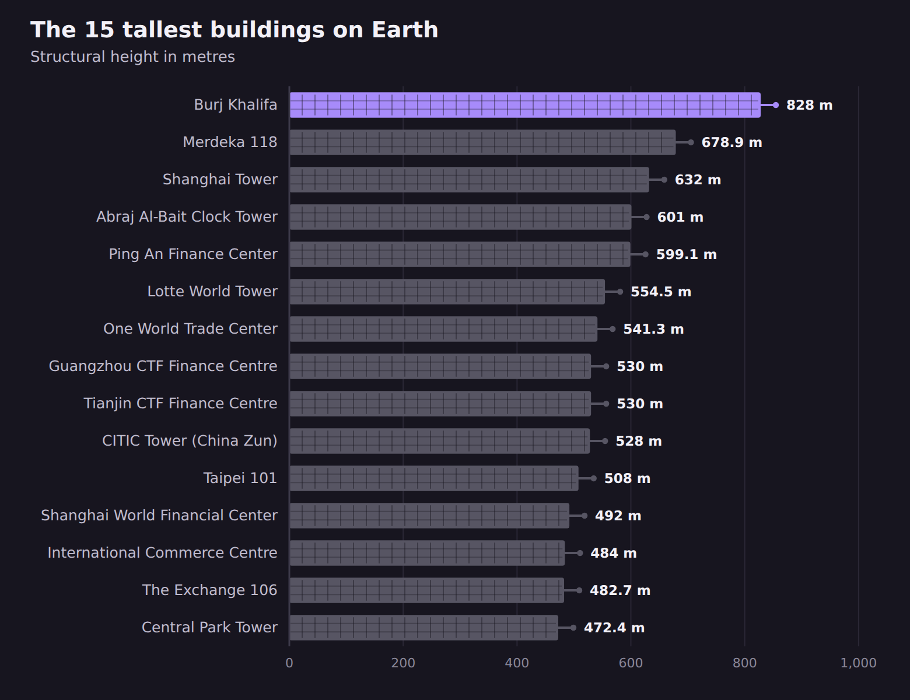

# vizcraft

A **zero-dependency** Python library of **creative** SVG charts — the ones you
don't get out of the box. No matplotlib, no pandas, no compiled extensions:
pure standard-library Python that emits portable SVG. Ships with the
tallest-buildings dataset so you can render something interesting immediately.

Five chart types, **deliberately no pie, heatmap, or table**:

| Function | What it's for |
|---|---|
| `lollipop_chart` | ranked magnitude — a lighter-weight bar chart |
| `radial_bar_chart` | magnitude fanned around a circle ("a skyline in the round") |
| `bubble_chart` | three–four numerics at once: x, y, bubble size, and color |
| `dumbbell_chart` | a low→high range per category, drawn as a windowed tower |
| `beeswarm_chart` | a value distribution as non-overlapping dots |

Every chart uses a bright, fun palette, one **accent** color for emphasis
with **muted** gray for the rest, and works in `light` or `dark` themes.

## Gallery

All rendered from the bundled `tallest_buildings.csv`.

### Lollipop — the 15 tallest buildings


### Radial bar — a skyline in the round


### Bubble — year vs height, size = floors, color = use type


### Building range — each country's shortest-to-tallest, as towers
The vertical axis is height; each connector is drawn as a windowed building
spanning that country's shortest to tallest structure.


### Beeswarm — the height distribution, dot by dot


### Dark theme
Every chart supports `theme="dark"`:



> These images live in [`docs/charts/`](docs/charts) and are regenerated from
> the SVGs produced by `python examples/gallery.py`.

## Installation

```bash
pip install -e .
```

## Quick start

```python
import vizcraft as vc

data = vc.load_tallest_buildings()          # bundled dataset (31 buildings)
top = data.top("height_m", 15)              # 15 tallest, ordered

vc.lollipop_chart(
    top.column("building"), top.column("height_m"),
    title="The 15 tallest buildings on Earth",
    subtitle="Structural height in metres",
    highlight="Burj Khalifa", unit=" m",
).save("tallest.svg")
```

Every chart function returns an `SVG` object with `.save(path)` and
`.to_string()`.

## The bundled dataset

`load_tallest_buildings()` returns 31 rows — the world's tallest buildings and
structures:

| column | example | notes |
|---|---|---|
| `rank` | `1` | 1–31 |
| `building` | `Burj Khalifa` | name |
| `city`, `country` | `Dubai`, `United Arab Emirates` | categorical |
| `height_m`, `height_ft` | `828`, `2717` | numeric |
| `year_completed` | `2010` | temporal |
| `floors` | `163` | numeric — `Eiffel Tower` is `None` (it's a tower) |
| `use_type` | `mixed-use` | categorical |

The tiny `Dataset` helper covers what the charts need: `column`, `unique`,
`filter`, `dropna`, `sort_by`, `top`, and `groups`.

## More examples

```python
import vizcraft as vc
data = vc.load_tallest_buildings()

# Radial bars — the 14 tallest fanned around a circle
top14 = data.top("height_m", 14)
vc.radial_bar_chart(top14.column("building"), top14.column("height_m"),
                    highlight="Burj Khalifa", unit=" m",
                    title="A skyline in the round").save("radial.svg")

# Bubble — year vs height, bubble size = floors, color = use type
b = data.dropna("floors")
vc.bubble_chart(
    b.column("year_completed"), b.column("height_m"), b.column("floors"),
    groups=b.column("use_type"),
    x_label="Year completed", y_label="Height (m)", size_label="floors",
    x_tick_format=lambda v: str(int(v)),     # years, not comma-grouped
    title="Taller, busier, and mostly built this century",
).save("bubble.svg")

# Dumbbell — each country's shortest-to-tallest range
cats, lo, hi = [], [], []
for country, ds in data.groups("country").items():
    h = ds.column("height_m")
    if len(h) >= 2:
        cats.append(country); lo.append(min(h)); hi.append(max(h))
vc.dumbbell_chart(cats, lo, hi, low_label="shortest", high_label="tallest",
                  unit=" m", title="How far apart are each country's giants?").save("dumbbell.svg")

# Beeswarm — the height distribution, tallest few named
vc.beeswarm_chart(data.column("height_m"), groups=data.column("use_type"),
                  labels=data.column("building"),
                  highlight_labels=["Burj Khalifa", "Merdeka 118"],
                  x_label="Height (m)",
                  title="Most cluster between 300 and 550 metres").save("beeswarm.svg")
```

## Render the full gallery

```bash
python examples/gallery.py       # writes SVGs + index.html to examples/output/
```

Open `examples/output/index.html` in a browser to see one of every chart type
rendered from the bundled dataset (light and dark).

> **Note:** SVGs are drawn by the library, but GitHub shows `.html`/`.svg` files
> as source — open the generated files locally (or via GitHub Pages) to see them
> rendered.

## Theming

Pass `theme="light"` (default) or `theme="dark"` to any chart, or a custom
`vizcraft.Theme`.

## Project structure

```
visualization/
├── src/vizcraft/
│   ├── __init__.py         # public API
│   ├── charts.py           # lollipop / radial bar / bubble / dumbbell / beeswarm
│   ├── dataset.py          # Dataset + load_tallest_buildings()
│   ├── palette.py          # colorblind-safe light & dark themes
│   ├── scales.py           # linear + band scales, nice ticks
│   ├── svg.py              # zero-dependency SVG builder
│   └── datasets/
│       └── tallest_buildings.csv
├── examples/gallery.py
├── tests/
├── README.md
├── pyproject.toml
└── LICENSE
```

## Development

```bash
pip install -e ".[dev]"
pytest
```
